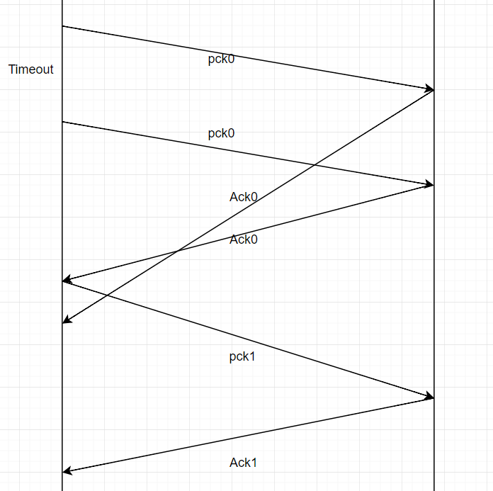

## 2

B to A: SP 80 -> DP 26145, SIP b -> DIP a

B to C1: SP 80 -> DP 7532, SIP b -> DIP c

B to C2: SP 80 -> DP 26145, SIP b -> DIP c


## 3

the check sum is 11010001

to detect one bit error, add these numbers and if there is a '0', there must be some error.

two bits error cannot be deteced.

The reason why UDP use 1s-complement sum is that:

> CPUs also have capability to trivially take 1's complements, and detect that the result of the last calculation was zero without inspecting individual bits and branch based on that. So basically, it's an optimization that lets us check checksums really fast. Since most packets are just fine, this lets us check the checksum on the fly and get the data to the destination much faster.
>
> Reference: [How is a 1s complement checksum useful for error detection? - Stack Overflow](https://stackoverflow.com/a/5608873/8489782)


## 7

Since at any point in time, we just need to wait for exact 1 ACK. As for previous ACK with the same mark, we can use checksum to validate.


## 9




## 26

a) $L_{max} = 2^{32}$B

b) $\frac{66+536}{536} \cdot \frac{2^{32}B}{155Mbs^{-1}} = 237s$


## 40

a) slow start: [1, 6], [23, 26]

b) congestion avoidance: [6, 16], [17, 22]

c) 3 duplicate ACK. Since 3 dup ACK make $cwnd = cwnd / 2$, while timeout make $cwnd = 1$

d) timeout, reason seen in c)

e) 32, where the slow start stops.

f) $threshold = cwnd / 2 = 21​$

g) $threshold = cwnd / 2 = 14​$

h) during initial 6 rounds, $1 + 2+ 4+...+32 = 63$, and the 7th sends 32. Therefore the 70th segment is sent in 7th round.

i) $cwnd= threshold = cwnd / 2 = 4$

j) $cwnd = 1,\ threshold = cwnd/2 = 21​$

k) slow start: $1+...+16=31$; congestion avoidance: 21. Therefore the total amount of packets is 52.


## TCP应用程序

client 发送一组乱序数字，server 将数组排序并返回

serverTCP.py

```python
from socket import *

serverPort = 12020
serverSocket = socket(AF_INET, SOCK_STREAM)
serverSocket.bind(('10.132.20.3', serverPort))
serverSocket.listen(1)

print("The server is ready to receive")

while True:
    connectionSocket, addr = serverSocket.accept()
    unsorted_list = connectionSocket.recv(1024).decode()
    sorted_list = sorted(list(map(lambda str: int(str), str.split(unsorted_list))))
    connectionSocket.send(
        ('The sorted list is: ' + (''.join(map(lambda s: s + ' ', map(str, sorted_list)))))
            .encode())
    connectionSocket.close()
```

clientTCP.py

```python
from socket import *

serverName = "10.132.20.3"
serverPort = 12020
clientSocket = socket(AF_INET, SOCK_STREAM)
clientSocket.connect((serverName, serverPort))

sentence = "1 17 8 233"
clientSocket.send(sentence.encode())

modifiedSentence = clientSocket.recv(1024)
print("From Server:", modifiedSentence.decode())

clientSocket.close()
```

