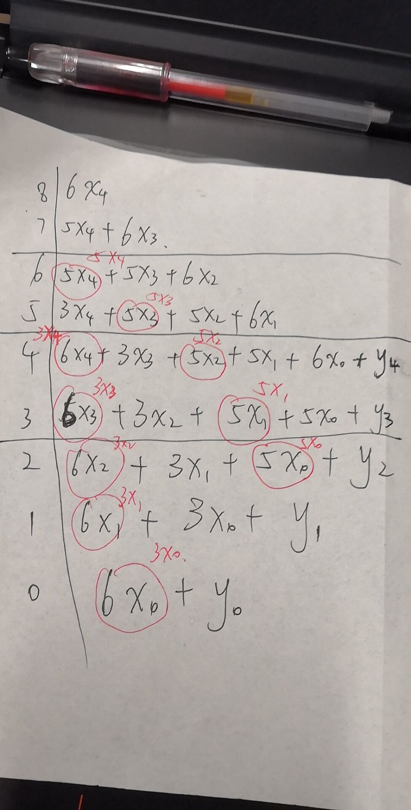

# 计算机接口与通信作业（汇编）

> 访问 github 时请在 url 后加上 `?ts=4` 使得 tab 表示 4 个空格。

&nbsp;   

## 1. [求100以内所有质数](https://github.com/rsy56640/Assignment-in-WHUISS/blob/master/Other/Asm-AS/prime.asm?ts=4)

注意到若 $n$ 不是质数，则 $\exist q\le \sqrt{n},\quad s.t.\ q|n$，所以写了一个简易的计算 $int(\sqrt{n})$ 的函数。

&nbsp;

## 2. [计算前30位斐波那契数（使用16位寄存器，注意溢出，每次输出一位数字）](https://github.com/rsy56640/Assignment-in-WHUISS/blob/master/Other/Asm-AS/fib30_16reg_print_one_char.asm?ts=4)

基本计算方法：$(a,b) = (b, a+b)$，不断迭代（交换 $a,b$ 时采用3次异或运算）

$a,b$ 均使用2个16位寄存器拼成32位寄存器模拟加法，每一轮都将 $a$ 的低16位和高16位送去 `print_fib PROC` 打印。

$x,y$ 分别表示高16位和低16位，将其表示为十进制：（注意到 $0 \le x,y \le 65535$）
$$
\begin{aligned}
& x = x_4*10^4 + x_3*10^3 + x_2*10^2 + x_1*10^1 + x_0*10^0 \\
& y = y_4*10^4 + y_3*10^3 + y_2*10^2 + y_1*10^1 + y_0*10^0 \\
& result = x \cdot 2^{16} + y = 65536x + y \\
\end{aligned}
$$
将表达式展开得：

| exponent | coefficient                    |
| -------- | ------------------------------ |
| $10^8$   | $6x_4$                         |
| $10^7$   | $5x_4+6x_3$                    |
| $10^6$   | $5x_4+5x_3+6x_2$               |
| $10^5$   | $3x_4+5x_3+5x_2+6x_1$          |
| $10^4$   | $6x_4+3x_3+5x_2+5x_1+6x_0+y_4$ |
| $10^3$   | $6x_3+3x_2+5x_1+5x_0+y_3$      |
| $10^2$   | $6x_2+3x_1+5x_0+y_2$           |
| $10^1$   | $6x_1+3x_0+y_1$                |
| $10^0$   | $6x_0+y_0$                     |

这样我们直接计算每一位的值，与此同时维护2个进位器（因为有可能进不止1位）

为了加速计算过程，使用了4个临时变量来储存中间结果：

|   var   |            value            |
| :-----: | :-------------------------: |
| `temp0` | $3x_0,\ 5x_0,\ 3x_4,\ 5x_4$ |
| `temp1` |        $3x_1,\ 5x_1$        |
| `temp2` |        $3x_2,\ 5x_2$        |
| `temp3` |        $3x_3, 5x_3$         |

value 的变化表示在不同时期缓存的不同值。

**红色圈**表示在计算这个值的过程中将其缓存，缓存的取值为**红笔标注**的值。

打印时先找到第一个非0数字，然后依次打印每一个数字即可。

&nbsp;   

## 3. [八皇后](https://github.com/rsy56640/Assignment-in-WHUISS/blob/master/Other/Asm-AS/eight_queen.asm?ts=4)

基本思路：用一个长度为8的一维数组来表示位置，即 `queen[i]` 表示第i列的皇后位于第几行。递归地尝试每一个可能值，注意递归时要记录之前的状态。
