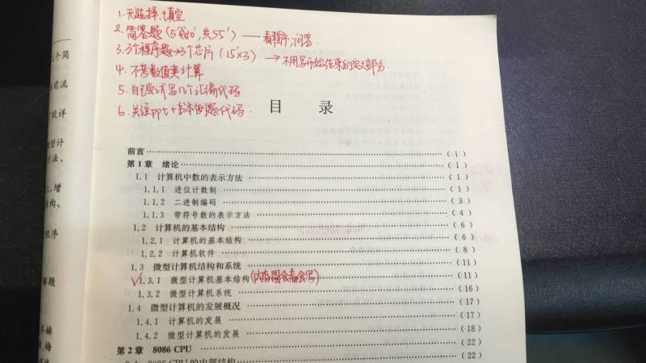

# 考试范围

- **汇编程序设计**（重点）
- 第11,12章 DMA, 总线
- P355 习题**1,2,4,6**等
- 第10章 **P334.3** D\A转换器
- 第9章 8251编程
- 第8章 中断 8259A
- 第7章 8253
- 第6章 8255
- 第5章 存储器
- **第4章**（重点）
- **第3章**（重点）3.1**寻址方式**，寄存器状态变化，汇编的结果
- 第2,1章 二进制数表示

**课后习题**

开卷考试

题型：简答，汇编程序设计

