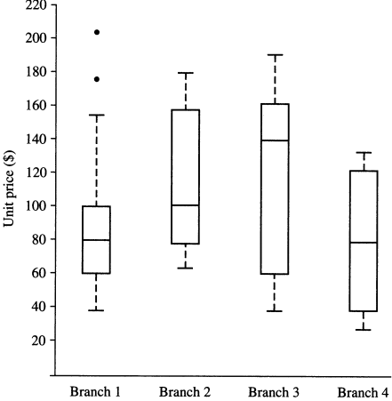

# 商务智能1-任思远-2016302580320

### 1.

Privacy is easy to be leaked because a data miner might use your data to support some purposes that you don't like. For example, your private information might be leveraged by Ad-Com, which might recommend you with its products.

As for Ethical concern: 

> In 2014, Facebook reported an experiment to test if emotions like happiness or depression could traverse through social media. For this, researchers tweaked their newsfeed algorithm to propagate positive and negative feeds to two different populations. The study was carried out to understand the effects of emotional contagion.   When news of the experiment surfaced, it was criticized from an ethical standpoint. The ethics of the study were questioned, in the context of informed consent and on the basis of the amount of harm caused due to experimentation. 

From this case we can know, the data mining should be carried before the basis of your intention is ensured to be harmless to others.

### 2.

Skewness is a measure of the asymmetry of the probability distribution of a real-valued random variable about its mean. 
$$
Skewness = \frac{\sum_{i=1}^n (x_i - \overline x)^3}{(n-1)s^3}
$$

Code is here: [`Negative Skewness.m`](https://github.com/rsy56640/Assignment-in-WHUISS/blob/master/Other/Business_Intelligence-As/As/1/code/2/Negative%20Skewness.m)

### 3.

- Branch 1: The exception point are greater than maximum, so Skewness is positive.
- Branch 2: The Skewness is positive.
- Branch 3: The Skewness is negative.
- Branch 4: It's symmetric. The Skewness is 0.

### 4.

For each data set, replace the value with the exact percentage of the data in the dataset.

### 5.

| 属性类别 | numeric | numeric | scalar   | ordinal | binary     | numeric | numeric |
| -------- | ------- | ------- | -------- | ------- | ---------- | ------- | ------- |
|          | 大小    | 含水量  | 成熟季节 | pH      | 是否要去皮 | 维C     | 蛋白质  |
| 苹果     | 113     | 0.68    | "fall"   | 4.9     | false      | 4.0     | 0.27    |
| 梨       | 100     | 0.71    | "fall"   | 3.5     | false      | 4.0     | 0.3     |
| 西瓜     | 5000    | 0.91    | "summer" | 6.6     | true       | 8.1     | 0.61    |
| 葡萄     | 4.0     | 0.83    | "summer" | 4.5     | true       | 10.8    | 0.72    |
| 草莓     | 5       | 0.81    | "summer" | 3.0     | false      | 58.8    | 0.67    |

Code is here: [`dissimilarity.hpp`](https://github.com/rsy56640/Assignment-in-WHUISS/blob/master/Other/Business_Intelligence-As/As/1/code/5_6/dissimilarity.hpp) (C++17 implementation)

### 6.

### Apriori

Apriori is an algorithm for frequent item set mining and association rule learning over transactional databases. It proceeds by identifying the frequent individual items in the database and extending them to larger and larger item sets as long as those item sets appear sufficiently often in the database. The frequent item sets determined by Apriori can be used to determine association rules which highlight general trends in the database.

Procedure of Apriori algorithm:

- scan all the data items whose support are greater than min_support.
- mine the K-frequent-set:
  - scan the support of each k-item.
  - filter, if:
    - k-set is empty, return all (k-1)-frequent sets generated before.
    - k-set has only one item, return this very item.
    - else join to generate (k+1)-frequent sets.
  - loop until break from previous procedure.

Code is here: [`Apriori.h`](https://github.com/rsy56640/Assignment-in-WHUISS/blob/master/Other/Business_Intelligence-As/As/1/code/5_6/Apriori.h) (C++17 Industrial level implementation)

### FPGrowth

FP-growth algorithm is based on frequent pattern tree, which indeed is a prefix-tree. Compared to Apriori algorithm, FP-growth reads less times on database, exactly only twice.

The procedure of FP-growth algorithm:

- construct FP-tree
- recursively mine from bottom to top
  - if current FP-tree is not a single line from top down, then recursively collect conditional-FP-tree for each of its item.
  - if current FP-tree is a single line, then combine all the items on that line to form the frequent item sets, and add to total-set with postfix-items.

As for the opportunities to add to total-set, I found almost tutorial on the Internet is obscure or misleading.

In fact, there are 4 cases to insert into total-sets.

- When recursively construct conditional-FP-tree, we get sub-branches of one item. If any of the branches are empty, immediately add those into total-set.
- After prune conditional-FP-tree according to min_support, if any of the branches are empty, immediately add those into total-set.
- If conditional-FP-tree is not a single-line, postfix set and current item should be immediately added into total-set, with the support of size of current item.
- If conditional-FP-tree is a single-line: slice the branches to generate several lines of item-sets, in which all the items have the same support, then add (($2^N$ sets + _to_be_added) * support) into total-set.

Code is here: [`FPTImpl.hpp`](https://github.com/rsy56640/Assignment-in-WHUISS/blob/master/Other/Business_Intelligence-As/As/1/code/5_6/FPTImpl.hpp), [`Apriori.h`](https://github.com/rsy56640/Assignment-in-WHUISS/blob/master/Other/Business_Intelligence-As/As/1/code/5_6/Apriori.h) (C++17 Industrial level implementation)

Code View:

- `Apriori.h`: implement Apriori algorithm and FP entry point.
- `FPTImpl.hpp`, `FPT.hpp`, `FPTNode.hpp`, `FPTType` is for FP-growth algorithm
- 2000 lines of C++17 industrial level codes in total, with a small log system. The most important is the algorithm is implemented **generically**, that is, users can write some codes themselves and might want to do data mining on their own data type, so they can use generic algorithm with high efficiency.
- Optimization: 
  - prune before join operation
  - if one k-1 set cannot be joined to k set, add it into total set immediately
  - Bloom Filter in generation rules
  - efficient resource management: using move semantics rather than data copying

### Data generation

Data distribution is chosen as normal distribution at first, but it has non-natural result, so finally I use normal distribution with some customized association rules to generate data. That is, $N(60, 26.7)$ for the first round of data distribution, then for each data set, choose some items and add their associated items.

>Since the result of 10000 transactions is not ideal, I use 2500 transactions instead, with 100 amount of items, each transaction about 65 items.

1) $confidence = 80\%$

Data is here: [6_1Ap](https://github.com/rsy56640/Assignment-in-WHUISS/tree/master/Other/Business_Intelligence-As/As/1/data/6_1Ap)

2) $support = 30\%$

Data is here: [6_2Fp](https://github.com/rsy56640/Assignment-in-WHUISS/tree/master/Other/Business_Intelligence-As/As/1/data/6_2Fp)

3) $confidence = 80\%\quad s= 35\%\quad association rules = 21$

(according to data set [6_1Ap](https://github.com/rsy56640/Assignment-in-WHUISS/tree/master/Other/Business_Intelligence-As/As/1/data/6_1Ap))

### 7.

$\hat{\pmb w}=(\pmb w;b)$
$$
\pmb X=\left (\begin{array}{c:c}
\begin{matrix}
 x_{11}   & x_{12}   & \cdots   & x_{1d}   \\
 x_{21}   & x_{22}   & \cdots   & x_{2d}   \\
 \vdots   & \vdots   & \ddots   & \vdots   \\
 x_{m1}   & x_{m2}   & \cdots   & x_{md}   \\
\end{matrix}&
\begin{matrix}
1      \\
1      \\
\vdots \\
1      \\
\end{matrix}
\end{array}
\right )
=\begin{pmatrix}
\pmb x_1^T   & 1        \\
\pmb x_1^T   & 1        \\
\vdots       & \vdots   \\
\pmb x_1^T   & 1        \\
\end{pmatrix}
$$
$\pmb y=(y_1;y_2;...;y_m)$

minimalize the cost function：
$$
\begin{aligned}
(w^*,b^*)
& = argmin_{(w,b)}L\\
& = argmin_{(w,b)}\sum_i (f(\pmb{x_i})-y_i)^2\\
& = argmin_{(w,b)}\sum_i (\pmb w^T\pmb{x_i}+b-y_i)^2\\
& = argmin_{(w,b)}\sum_i (\hat{\pmb w}^T\pmb x_i-y_i)^2\\
& = argmin_{(w,b)}(\pmb X\hat{\pmb w}-\pmb y)^T(\pmb X\hat{\pmb w}-\pmb y)
\end{aligned}
$$
Now we use gradient descent algorithm:
$$
\frac{\partial L}{\partial \hat{\pmb w}}=2\pmb X^T(\pmb X\hat{\pmb w}-\pmb y)
$$
Thus the iterative function:
$$
\hat{\pmb w} = \hat{\pmb w} - \alpha * \frac{1}{n}\pmb X^T(\pmb X \hat{\pmb w} -\pmb Y)
$$

Code is here: [main.py](https://github.com/rsy56640/Assignment-in-WHUISS/blob/master/Other/Business_Intelligence-As/As/1/code/7/main.py)
