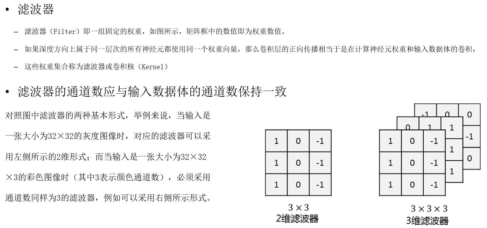

# 商务智能

考勤 20%   
作业 30%   
项目 50%   

Business Intelligence:
> quote的地方大多是我自己写的！！！！！！！！！！！！！！！！！！！！！！！！！！！

> a domain of business and computer technology in which business managers use data analysis to evaluate the business information and make prediction.

## Business Analytics Overview

- Descriptive Analytics
- Predictive Analytics
- Prescriptive Analytics

> BI: to figure out the situation and use data analysis to make prediction of business strategy and make proposals.

# Data Mining

## Process Of Data Mining

- Data cleaning 清除噪声
- Data integration 组合多种数据源 
- Data selection 选择相关的数据
- Data trasformation 格式
- Data mining 算法
- Pattern evaluation 
- Knowledge presentation

## 2018-09-29 深度学习基础 深度学习概论与 PaddlePaddle 入门

## 市场情况分析

### 关联规则

$A => B [s, c]$

- $s = P(AB)$
- $c = P(B|A) = P(AB) / P(A)$

Apriori 算法

- [数据挖掘十大算法--Apriori算法](https://wizardforcel.gitbooks.io/dm-algo-top10/content/apriori.html)
- [频繁项集挖掘算法之FPGrowth](https://blog.csdn.net/huagong_adu/article/details/17739247)
- [Apriori algorithm](https://en.wikipedia.org/wiki/Apriori_algorithm)
- [Apriori算法原理总结](https://www.cnblogs.com/pinard/p/6293298.html)
- [Apriori with FREQUENT PATTERN TREE](https://arxiv.org/ftp/arxiv/papers/1411/1411.6224.pdf)
- [第12章 使用FP-growth算法来高效发现频繁项集](http://ml.apachecn.org/mlia/fp-growth/)
- [频繁项集挖掘之apriori和fp-growth](https://blog.csdn.net/lgnlgn/article/details/7614892)

## 神经网络入门

卷积神经网络

- 卷积层
- 池化层

卷积层的作用：

- 发掘出输入数据（图片）的局部关联性质和空间不变性质。
- 执行卷积操作提取底层到高层的特征。

卷积层的构成：

- 由一系列参数可学习的滤波器集合构成。
- 每个卷积层上都会有一组滤波器。
- 每个滤波器都会生成一个对应的2维特征图，将这些特征图在不同通道上层叠起来就得到了输出数据体。

滤波器：通过改变这些滤波器的权重值，使得这些滤波器对特定的特征有高的激活值，从而识别特定的特征，以达到CNN网络分类、检测等目的。

- 第一个卷积层的滤波器检测到的是低阶特征（比如边、角、曲线等）。
- 第二个卷积层的输入实际上是第一层的输出，这一层的滤波器往往被用来检测低价特征的组合情况，如半圆、四边形等。如此累积递进，能够检测到更复杂、更抽象的特征。

（实际上，这与人类大脑处理视觉信息时所遵循的从低阶特征到高阶特征的模式是一致的）

池化层