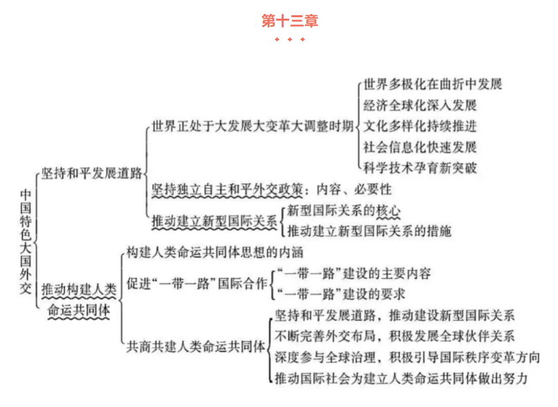

[2018版毛概思考题答案](https://wenku.baidu.com/view/a9788793fbb069dc5022aaea998fcc22bcd1432e.html)

# 重点

- [第一节 中国特色社会主义进入新时代](#zhongguoteseshehuizhuyijinruxinshidai)
  - [历史性成就和历史性变革](#shigefangmianlishixingchengjiu)
  - [社会主要矛盾的变化](#shehuizhuyaomaodundebianhua)
  - [新时代的内涵和意义](#xinshidaideneihanheyiyi)
- [第二节 习近平新时代中国特色社会主义思想的核心要义和丰富内涵](#xijinpingxinshidaizhongguoteseshehuizhuyisixiangdehexinyaoyihefengfuneihan)
  - [思想内涵](#2sixiangneihan)
  - [坚持和发展中国特色社会主义的基本方略](#2jianchihefazhanzhongguoteseshehuizhuyidejibenfanglve)
- [第三节 习近平新时代中国特色社会主义思想的历史地位](#xinjinpingxinshidaizhongguoteseshehuizhuyisixiangdelishidiwei)

&nbsp;   
### 五位一体总体布局 和 四个全面战略布局

按照中国特色社会主义事业“五位一体”总体布局和“四个全面”战略布局，统筹推进经济建设、政治建设、文化建设、社会建设、生态文明建设，协调推进全面建成小康社会、全面深化改革、全面依法治国、全面从严治党

&nbsp;   

## 第一节 中国特色社会主义进入新时代

- [历史性成就和历史性变革](#shigefangmianlishixingchengjiu)
- [社会主要矛盾的变化](#shehuizhuyaomaodundebianhua)
- [新时代的内涵和意义](#xinshidaideneihanheyiyi)

### 十个方面历史性成就：   
1. 经济建设取得重大成就   
2. 全面深化改革取得重大突破   
3. 民主法治建设迈出重大步伐   
4. 思想文化建设取得重大进展   
5. 人民生活不断改善   
6. 生态文明建设成效显著   
7. 强军兴军开创新局面   
8. 港澳台工作取得新进展   
9. 全方位外交布局深入展开   
10. 全面从严治党成效卓著

&nbsp;   

### 社会主要矛盾的变化：

- 1956：先进的社会主义制度同落后的社会生产力之间的矛盾。
- 1962：无产阶级同资产阶级的矛盾
- 1981（十一届六中全会）：人民日益增长的物质文化需要同落后的社会生产力之间的矛盾。
- 现在的矛盾：人民日益增长的美好生活需求和不平衡不充分发展之间的矛盾。

#### 矛盾转化：

- 不发达 → 中等发达
- 贫困人口占大多数 → 最终消除贫困人口
- 贫困 → 温饱，小康社会 → 共同富裕
- 传统农业 → 工业化、信息化、城镇化
- 农业人口 → 非农业人口占多数，现代农业和现代服务业占主导的世界工业大国
- 科技教育落后 → 世界教育大国与科技创新之路

#### 矛盾转化的主要依据：

- 生产力水平总体上显著提高。
- 人民生活水平显著提高，对美好生活的向往更加强烈。
- 影响满足人们美好生活需要的因素主要是发展不平衡不充分问题。

&nbsp;   

### 新时代的内涵和意义

1. 这个时代是承前启后、继往开来，在新的历史条件下继续夺取中国特色社会主义伟大胜利的时代   
2. 这个时代是决胜全面小康社会、进而全面建设社会主义现代化强国的时代   
3. 这个时代是全国各族人民团结奋斗、不断创造美好生活、逐步实现全体人民共同富裕的时代   
4. 这个时代是全体中华儿女勠力同心、奋力实现中华民族伟大复兴中国梦的时代   
5. 这个时代是我国日益走进世界舞台中央、不断为人类作出更大贡献的时代   

#### 对新时代的认识：

- 过去我们取得的成就
- 社会矛盾分析
- 新时代的内涵和意义

#### 新时代的意义：（“三个意味着”）

- 从历史维度讲：
  - **中华民族复兴的历史进程**：意味着久经磨难的中华民族实现了从站起来到富起来，强起来的历史性飞跃。
- 从理论维度讲：
  - **科学社会主义发展过程**：意味着社会主义在中国焕发出强大额生命力并不断开辟发展新境界。
- 从世界维度讲：
  - **人类文明进程**：意味着中国特色社会主义拓展了发展中国家走向现代化的途径。“中国智慧” 和 “中国方案”

&nbsp;   

## 第二节 习近平新时代中国特色社会主义思想的主要内容

- [思想内涵](#2sixiangneihan)
- [坚持和发展中国特色社会主义的基本方略](#2jianchihefazhanzhongguoteseshehuizhuyidejibenfanglve)

&nbsp;   

### 思想内涵：8个明确

**总任务**：分两步走在本世纪中叶建成富强民主文明和谐的社会主义现代化强国。

- 第一步：从2020年到2035年，基本实现社会主义现代化
- 第二步：从2035年到2050年，把我国建成富强、民主、文明、和谐、美丽的社会主义现代化强国

1. **根本主题和目标任务**：明确坚持和发展中国特社会主义。
2. **国情实际和发展方向**：明确新时代我国社会主要矛盾是人民日益增长的美好生活需要和不平衡不充分的发展之间的矛盾
3. **两大布局和总体方略**：明确中国特色社会主义事业总体布局是“五位一体”，战略布局是“四个全面”，强调坚信“四个自信”
4. **发展方式和发展动力**：明确全面深化改革总目标是完善和发展中国特色社会主义制度、推进国家治理体系和治理能力现代化
5. **法治环境和法治保障**：明确全面推进依法治国总目标是建设中国特色社会主义法治体系、建设社会主义法治国家
6. **军事条件和军事保障**：明确党在新时代的强军目标是建设一支听党指挥、能打胜仗、作风优良的人民军队，把人民军队建设成为世界一流军队
7. **国际环境和外交保障**：明确中国特色大国外交要推动构建新型国际关系，推动构建人类命运共同体
8. **领导力量和政治保障**：中国共产党的领导，是中国特色社会主义最本质的特质和中国特色社会主义制度的最大优势

&nbsp;   

### 坚持和发展中国特色社会主义的基本方略

- **八个明确**：是指导思想层面的表述，重点讲的是怎么看，回答的是新时代坚持和发展什么样的中国特色社会主义的问题
- **十四个坚持**：是行动纲领层面的表述，重点讲的是怎么办，回答的是新时代怎样坚持和发展中国特色社会主义的问题

“**八个明确**”和“**十四个坚持**”体现了习近平新时代中国特色社会主义思想理论与实践的统一。

基本方略（十四个坚持）：

1. 坚持党对一切工作的领导
2. 坚持以人民为中心
3. 坚持全面深化改革
4. 坚持新发展理念
5. 坚持人民当家作主
6. 坚持全面依法治国
7. 坚持社会主义核心价值体系
8. 坚持在发展中保障和改善民生
9. 坚持人与自然和谐共生
10. 坚持总体国家安全观
11. 坚持党对人民军队的绝对领导
12. 坚持“一国两制”和推进祖国统一
13. 坚持推动构建人类命运共同体
14. 坚持全面从严治党

&nbsp;   

## 第三节 习近平新时代中国特色社会主义思想的历史地位

- **马克思主义中国化最新成果**
  - 开辟新型现代化之路
  - 提供新型经济全球化方案
  - 倡导“一带一路”建设
  - 提出世界经济复苏方案
  - 提出“人类命运共同体”理念
  - 提出共商共建共享原则
- **新时代的精神旗帜**
  - 新思想是实践探索、经验总结、理论升华凝结而成的思想结晶
  - 新思想是中华文化创造性转化和创新性发展的思想成果
  - 新思想是当今时代最富中国味、最具中国魂的科学理论
- **实现中华民族伟大复兴的行动指南**
  - 为新时代坚持和发展中国特色社会主义提供了根本指引
  - 为新时代治国理政提供了基本遵循
  - 为全面从严治党、把党建设成为中国特色社会主义事业的坚强领导核心提供了强大思想武器

## [习近平庆祝改革开放40周年大会讲话（全文批注版）](https://mp.weixin.qq.com/s/E36vuccScUV0rWo4Idh0cQ)

# 第九章 中国梦 习近平的三句话

重点：中国梦 两个阶段

-----

构建人类命运共同体的内涵与外延

-----
-----

## 复习随记

毛泽东思想是在革命和建设的长期实践中，以毛泽东为主要代表的中国共产党人，根据马克思列宁主义基本原理，形成的适合中国情况的科学指导思想，是被实践证明了的关于中国革命和建设的正确的理论原则和经验总结，是中国共产党集体智慧的结晶，毛泽东思想以独创性理论丰富和发展了马克思列宁主义。

1978年召开的党的十一届三中全会，实现了新中国成立以来党的历史上具有深远意义的伟大转折，开启了改革开放和社会主义现代化建设历史新时期。
在邓小平理论的指导下，20世纪的中国又一次发生了翻天覆地的变化，开启了中华民族“富起来”的新征程。

党的十八大以来，以习近平为主要代表的中国共产党人以巨大的政治勇气和强烈的责任担当，提出一系列新理念新思想新战略，从理论和实践结合上系统回答了新时代坚持和发展什么样的中国特色社会主义、怎样坚持和发展中国特色社会主义这个重大时代课题，创立了习近平新时代中国特色社会主义思想。

### 毛泽东思想的主要内容 和 活的灵魂 

**活的灵魂**：**实事求是**，**群众路线**，**独立自主**

近代中国革命的时代特征

社会性质 和 主要矛盾 ==》 决定 革命性质是资产阶级民主革命   
时代背景的转换 ==》 决定 中国革命具有鲜明的时代特点

**旧民主主义革命实践**：太平天国运动、戊戌变法、义和团运动、辛亥革命
**旧民主主义革命实践的历史启示**：不触动封建根基的自强运动和改良主义，旧式的农民战争，资产阶级革命派领导的民主革命，以及照搬西方资本主义的其他种种方案，都不能完成反帝、反封建的革命任务。旧式民主主义革命的理论和道路，并不适应中国革命的现实国情，无法为近代中国革命提供正确的理论指南和实践指导，无法指引近代中国革命取得胜利。近代中国社会和革命斗争的发展，迫切期待新的阶级及其政党领导新的革命，呼唤新的革命理论的诞生。

**新民主主义革命的三大法宝**：**统一战线**、**武装斗争**、**党的建设**

### 新民主主义向社会主义转变，过渡时期总路线

**过渡时期总路线**内容：在一个相当长的时期内，逐步实现国家的社会主义**工业化**，并逐步实现国家对**农业**、对**手工业**和对**资本主义工商业**的社会主义改造。（**一化三改造**）

总路线的实质和最显著的特点：

- 实质：使生产资料的社会主义公有制成为国家和社会唯一的经济基础
- 显著特点：工业化建设与社会主义改造同时并举
- 体现：解放生产力与发展生产力，变革生产关系与发展生产力的统一

毛泽东指出：“在社会主义社会中，基本的矛盾仍然是生产关系和生产力之间的矛盾，上层建筑和经济基础之间的矛盾。”

（我国社会的主要矛盾和根本任务）党的八大指出：社会主义制度在我国已经基本上建立起来了。我们国内的主要矛盾，已经是人民对于建立先进的工业国的要求同落后的农业国的现实之间的矛盾，已经是人民对于经济文化迅速发展的需要同当前经济文化不能满足人民需要的状况之间的矛盾。

初步探索的经验教训

- 必须把马克思主义与中国实际相结合，探索符合中国特点的社会主义建设道路
- 必须正确认识社会主义社会的主要矛盾和根本任务，集中力量发展生产力
- 必须从实际出发进行社会主义建设，建设规模和速度要和国力相适应，不能急于求成
- 必须发展社会主义民主，健全社会主义法制
- 必须坚持党的民主集中制和集体领导制度，加强执政党建设
- 必须坚持对外开放，借鉴和吸收人类文明成果建设社会主义，不能关起门来搞建设

### 邓小平理论，十一届三中全会，改革开放

邓小平对社会主义本质的结论：社会主义的本质，是解放生产力，发展生产力，消灭剩削，消除两极分化，最终达到共同高裕

### 中国梦的本质及实现路径 P199 须阅读

- 本质：国家富强、民族振兴、人民幸福
- 辨析：国家富强、民族振兴是人民幸福的基础和保障，人民幸福是国家富强、民族振兴的根本出发点和落脚点
- 实现路径：走中国道路、弘扬中国精神、凝聚中国力量

### 如何建设美丽中国 P237 须阅读

- 坚持人与自然和谐永生
- 形成人与自然和谐发展新格局
- 加快生态文明体制改革

### 党十九大

- 第一步：从2020年到2035年，基本实现社会主义现代化
- 第二步：从2035年到2050年，把我国建成富强、民主、文明、和谐、美丽的社会主义现代化强国

从现在到2020年，是全面建成小康社会决胜期。要按照十六大、十七大、十八大提出的全面建成小康社会各项要求，紧扣我国社会主要矛盾变化，统筹推进经济建设、政治建设、文化建设、社会建设、生态文明建设，坚定实施科教兴国战略、人才强国战略、创新驱动发展战略、乡村振兴战略、区域协调发展战略、可持续发展战略、军民融合发展战略，突出抓重点、补短板、强弱项，特别是要坚决打好防范化解重大风险、精准脱贫、污染防治的攻坚战，使全面建成小康社会得到人民认可、经得起历史检验。

&nbsp;   

