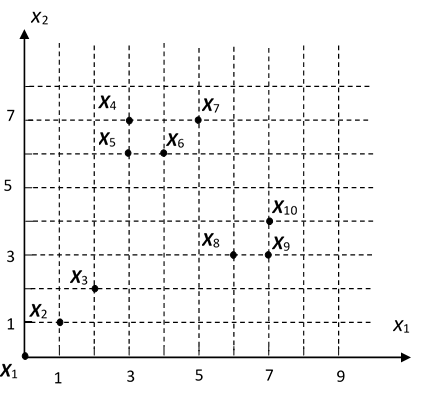

##  2016302580320 任思远 第二次作业

### 2.1



1. 选择 $X_1$ 作为 $Z_1$。
2. 选择距离最远的 $X_7$ 作为 $Z_2$。
3. 记 $M_i=min\{||X_i-Z_1||,\ |X_i-Z_2|\}$，经计算：

$$
\begin{aligned}
& M_2 = \sqrt{2} \\
& M_3 = 2\sqrt{2} \\
& M_4 = 2 \\
& M_5 = \sqrt{5} \\
& M_6 = \sqrt{2} \\
& M_8 = \sqrt{17} \\
& M_9 = \sqrt{20} \\
& M_{10} = \sqrt{13} \\
\end{aligned}
$$

$M_9>\theta||Z_1-Z_2||$，选择 $M_9$ 作为 $Z_3$，再无满足的点，结束聚类中心的选择。

4. 划分：

$\{X_1,X_2,X_3\},\ \{X_7,X_4,X_5,X_6\},\ \{X_9,X_8,X_{10}\}$


### 2.2

k-means算法流程：

input：样本集 $D=\{x_1,x_2,...,x_n\}$，聚类簇数 $k$.

output：聚类划分的集合。

算法流程：

1. 从 $D$ 中随机选择 $k$ 个作为初始均值向量 $\{\mu_1,\mu_2,...,\mu_k\}$.
2. loop until 均值向量不再变化（或变化不大，或其他近似条件）

令 $C_i=\varnothing,\quad i=1,...,k$ 表示每个聚类的集合，

$for\ j=1,...n:$

$\qquad $计算每个向量和均值向量的距离 $d_{ji}=dist(x_j,\mu_i),\quad i=1,...,k$

$\qquad $选择最近的簇，并加入 $\lambda_j=argmin_i \{d_{ji}\},\quad C_j\cup=x_j$

重新计算均值向量：

$for\ j=1,...,k:$

$\qquad \mu_j=\frac{1}{|C_j|}\sum_{x\in C_j}x$

3. 退出 2 中的 loop 后，得到的 $\{C_i\}\quad i=1,...,k$ 即为聚类划分。


[C++ 实现 k-means](https://github.com/rsy56640/daily_learning/tree/master/Machine_Learning/%E8%A5%BF%E7%93%9C%E4%B9%A6%E5%AD%A6%E4%B9%A0/code/k_means/k_means_in_Cpp) C++代码太长了，这里放不下。

[Python 实现 k-means](https://github.com/rsy56640/daily_learning/tree/master/Machine_Learning/%E8%A5%BF%E7%93%9C%E4%B9%A6%E5%AD%A6%E4%B9%A0/code/k_means/k_means_in_Python) Python代码：

```python
import numpy as np
from functools import reduce


def k_means(cluster_num: int, dist, *data_set):
    size = len(data_set)
    assert size >= cluster_num > 0
    s = set()
    while len(s) != cluster_num:
        s.add(np.random.random_integers(0, size - 1))

    mean_vecs = []  # mean vectors in each cluster, initialized with random vector selected in data set.
    for num in s:
        mean_vecs.append(data_set[num])

    C = []  # clusters
    for i in range(cluster_num):
        C.append([])

    isChanged = True

    '''
    Divide each vector into one of the sets,
    and calculate the new mean_vecs.
    
    Loop until mean_vecs have no change.
    '''
    while isChanged:
        isChanged = False
        for c in C:
            c.clear()

        # for each vector in data set, divide it into one of the clusters.
        for vec in data_set:
            d = dist(vec, mean_vecs[0])
            label = 0
            for l in range(cluster_num):
                cur_dist = dist(vec, mean_vecs[l])
                if cur_dist < d:
                    d = cur_dist
                    label = l
            C[label].append(vec)

        # update mean_vecs, and set up `isChanged` flag if needed
        for label in range(cluster_num):
            assert len(C[label]) > 0
            mean_vec = reduce(lambda x, y: x + y, C[label]) / len(C[label])
            if dist(mean_vec, mean_vecs[label]) > 10e-2:
                mean_vecs[label] = mean_vec
                isChanged = True

    return C
```

