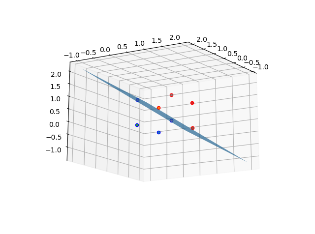
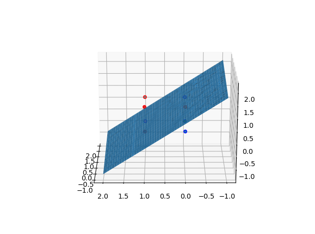
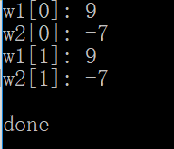

# 2016302580320-任思远-第四次作业

## 3.5

交替对 $w1,w2$ 的样本训练 100 次。

代码：[4_1.py](https://github.com/rsy56640/Assignment-in-WHUISS/blob/master/Parttern_recognition/As/4th/code/4_1.py)

```python
import numpy as np
import matplotlib.pyplot as plt
from mpl_toolkits.mplot3d import Axes3D

w1 = np.array([[0, 0, 0, 1],
               [1, 0, 0, 1],
               [1, 0, 1, 1],
               [1, 1, 0, 1]])
w2 = np.array([[0, 0, 1, 1],
               [0, 1, 1, 1],
               [0, 1, 0, 1],
               [1, 1, 1, 1]])
w2 = w2 * -1
W = np.array([-1, -2, -2, 0])
c = 0.1

for times in range(100):
    for i in range(4):
        if W.T.dot(w1[i]) <= 0:
            W = W + c * w1[i]
        if W.T.dot(w2[i]) <= 0:
            W = W + c * w2[i]

print(W)
for i in range(4):
    print(W.T.dot(w1[i]))
    print(W.T.dot(w2[i]))

fig = plt.figure()
ax = fig.add_subplot(1, 1, 1, projection='3d')
for i in range(4):
    ax.scatter(w1[i, 0], w1[i, 1], w1[i, 2], edgecolors='b')
    ax.scatter(-w2[i, 0], -w2[i, 1], -w2[i, 2], edgecolors='r')  # anti-normalization
x = np.linspace(-1, 2, 100)
y = np.linspace(-1, 2, 100)
X, Y = np.meshgrid(x, y)
Z = (-W[3] - W[0] * X - W[1] * Y) / W[2]
ax.plot_surface(X, Y, Z)
plt.show()
```






## 3.9

$$
\begin{aligned}
& K(\pmb X, \pmb X_k)=1 + (4\pmb X_{(2)}^2 - 2)(4\pmb X_{k_{(2)}}^2 - 2) + (4\pmb X_{(1)}^2 - 2)(4\pmb X_{k_{(1)}}^2 - 2) \\
& \pmb X_1 = \{0, 1\} \\
& \pmb X_2 = \{0, -1\} \\
& \pmb X_3 = \{1, 0\} \\
& \pmb X_4 = \{-1, 0\} \\
& k(\pmb X) = 0 \\
& iteration: \\
& 1.\ k(\pmb X_1) = 0 \le 0,\ update: \\
&\qquad k(\pmb X) = k(\pmb X) + K(\pmb X, \pmb X_1) = -8X_{(1)}^2 + 8X_{(2)}^2 + 1 \\
& 2.\ k(\pmb X_2) = -7 < 0,\ ok. \\
& 3.\ k(\pmb X_3) = 9 > 0,\ ok. \\
& 4.\ k(\pmb X_4) = -7 < 0,\ ok. \\
& Thus,\ k = -8X_{(1)}^2 + 8X_{(2)}^2 + 1 \\
\end{aligned}
$$

代码：[4_2.cpp](https://github.com/rsy56640/Assignment-in-WHUISS/blob/master/Parttern_recognition/As/4th/code/4_2.cpp)

```c++
#include <vector>
#include <functional>
#include <iostream>
#include <numeric>

void test()
{
	const std::vector<std::vector<double>> w1 = { { 0, 1 }, { 0, -1 } };
	const std::vector<std::vector<double>> w2 = { { 1, 0 }, { -1, 0 } };

	const std::function<double(double)> h[3] = {
		[](double) { return 1.0; },
		[](double x) { return 2 * x; },
		[](double x) { return 4 * x * x - 2; },
	};

	std::function<double(const std::vector<double>& X)> phi[3] = {
		[&h](const std::vector<double>& X) { return h[0](X[0]) * h[0](X[1]); },
		[&h](const std::vector<double>& X) { return h[0](X[0]) * h[2](X[1]); },
		[&h](const std::vector<double>& X) { return h[2](X[0]) * h[0](X[1]); },
	};

	const std::function<double(const std::vector<double>& X, const std::vector<double>& Xk)> K =
		[&phi](const std::vector<double>& X, const std::vector<double>& Xk)
	{
		return std::accumulate(std::begin(phi), std::end(phi), 0.0,
			[&X, &Xk](double val, const std::function<double(const std::vector<double>& X)>& phi)
		{ return val + phi(X) * phi(Xk); });
	};

	std::function<double(const std::vector<double>& X)> k = [](const std::vector<double>&) { return 0; };

	for (int times = 0; times < 1; times++)
		for (int i = 0; i < 2; i++)
		{
			if (k(w1[i]) <= 0)
				k = [k, i, &w1, &K](const std::vector<double>& X) { return k(X) + K(X, w1[i]); };
			if (k(w2[i]) >= 0)
				k = [k, i, &w2, &K](const std::vector<double>& X) { return k(X) - K(X, w2[i]); };
		}

	// check
	for (int i = 0; i < 2; i++)
	{
		std::cout << "w1[" << i << "]: " << k(w1[i]) << std::endl;
		std::cout << "w2[" << i << "]: " << k(w2[i]) << std::endl;
	}

}

int main()
{
	test();
	printf("\n%s\n", "done");
	getchar();
	return 0;
}
```

输出：

