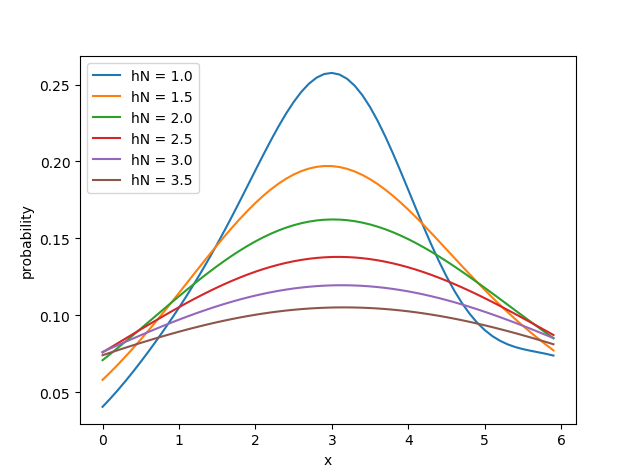

# 2016302580320-任思远-第六次作业

## 4.9

$$
\begin{align}
\hat p_N(x)
& = \frac{1}{N} \sum_{i=1}^N \delta(x-x_i) \\
& = \frac{1}{\sqrt{2\pi} \cdot N \cdot V_N} \sum_{i=1}^N e^{-\frac{(x-x_i)^2}{2 h_N^2}}

\end{align}
$$

取 $N = 6, R_6 = [0, 6.4], V_N = 6.4, h_N = 1$，得 $\hat p_6(x) = \frac{1}{\sqrt{2\pi} \cdot 6 \cdot 6.4}\sum_{i=1}^6 e^{-\frac{(x-x_i)^2}{2}}$

```python
import numpy as np
import matplotlib.pyplot as plt
from scipy.stats import norm

xi = [3.2, 3.6, 3, 6, 2.5, 1.1]
h = np.arange(1, 4, 0.5)
VN = 6.4


def p6(x: float, hN: float) -> float:
    return sum(map(norm.pdf, map(lambda _xi: (x - _xi) / hN, xi))) / len(xi) / VN


x = np.arange(0, 6, 0.1)

for hN in h:
    p6_hN = lambda x: p6(x, hN)
    y = list(map(p6_hN, x))
    plt.plot(x, y)

plt.legend(list(map(lambda hN: "hN = " + str(hN), h)), loc='upper left')
plt.xlabel("x")
plt.ylabel("probability")

plt.show()
```

