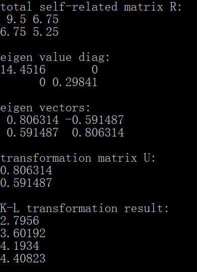

# 2016302580320-任思远-第七次作业

## 5.1

(1)
$$
\begin{align}
S
& = \frac{1}{n} \sum_k (X_k - M)(X_k - M)^T \\
& = 
\left( 
\begin{matrix}
\frac{1}{2}   & 0              \\
0             & \frac{3}{16}   \\
\end{matrix} 
\right)
\end{align}
$$

(2)
$$
\begin{aligned}
& \lambda_1 = \frac{1}{2}, x_1 = (1, 0)^T \\
& \lambda_2 = \frac{3}{16}, x_2 = (0, 1)^T \\
\end{aligned}
$$
(3)

采用 K-L 变换：

- 求自相关矩阵：

$$
\begin{aligned}
R
& = \frac{1}{n} \sum_k X_kX_k^T \\
& = 
\left(
\begin{matrix}
\frac{19}{2} & \frac{27}{4} \\
\frac{27}{4} & \frac{21}{4} \\
\end{matrix}
\right)
\end{aligned}
$$

- 求 $R$ 特征值，选择前 1 个，并计算特征向量：

$$
\begin{aligned}
& \lambda_1 = 14.45,\quad U = x_1 = (0.8,0.6)^T \\
& \lambda_2 = 0.2985 \\
\end{aligned}
$$

- 变换：$X^* = U^T X$

$$
\begin{aligned}
& X_1^* = 2.8 \\
& X_2^* = 3.6 \\
& X_3^* = 4.2 \\
& X_4^* = 4.4 \\
\end{aligned}
$$

[(C++)使用Eigen库实现K-L变换]()



```c++
#include <iostream>
#include <vector>
#include <utility>
#include <algorithm>
#include <type_traits>
#include <Eigen/Dense>
#include <Eigen/Eigenvalues>
namespace eigen = Eigen;

#define OUTPUT_INTERMEDIATE_RESULT

template<
	std::size_t N,
	typename = std::enable_if_t<(N > 0)>
		> std::vector<eigen::MatrixXd> // return Matrix: (d x 1) - Vector
	KL_transformation(
		const std::vector<eigen::Matrix<double, N, 1>>& vectors,
		const std::size_t dimension)
{
	assert((dimension > 0) && (dimension < N));

	// 1. calculate total self-related matrix R
	eigen::Matrix<double, N, N> R = eigen::Matrix<double, N, N>::Constant(0.0);
	for (auto const& v : vectors)
		R += v * v.transpose();
	R /= vectors.size();
#ifdef OUTPUT_INTERMEDIATE_RESULT
	std::cout << "total self-related matrix R:" << std::endl;
	std::cout << R << std::endl << std::endl;
#endif // OUTPUT_INTERMEDIATE_RESULT

	// 2. calculate the greater dimension eigenvalues and eigenvectors
	eigen::EigenSolver<eigen::Matrix<double, N, N>> _es{ R };
	eigen::Matrix<double, N, N> _diag = _es.pseudoEigenvalueMatrix();
	eigen::Matrix<double, N, N> _eigen_vectors = _es.pseudoEigenvectors();
#ifdef OUTPUT_INTERMEDIATE_RESULT
	std::cout << "eigen value diag:" << std::endl;
	std::cout << _diag << std::endl << std::endl;
	std::cout << "eigen vectors:" << std::endl;
	std::cout << _eigen_vectors << std::endl << std::endl;
#endif // OUTPUT_INTERMEDIATE_RESULT
	// sort
	std::vector<std::pair<double, std::size_t>> _eigenValues{ N };
	for (std::size_t i = 0; i < N; i++)
		_eigenValues[i] = std::pair<double, std::size_t>(_diag(i, i), i);
	std::sort(_eigenValues.begin(), _eigenValues.end(),
		[](const std::pair<double, std::size_t>& lhs, const std::pair<double, std::size_t>& rhs)
	{ return lhs.first >= rhs.first; });

	// 3. construct transformation matrix U
	eigen::MatrixXd U{ N, dimension };
	for (std::size_t i = 0; i < dimension; i++)
		U.block(0, i, N, 1) = _eigen_vectors.block(0, _eigenValues[i].second, N, 1);
#ifdef OUTPUT_INTERMEDIATE_RESULT
	std::cout << "transformation matrix U:" << std::endl;
	std::cout << U << std::endl << std::endl;
#endif // OUTPUT_INTERMEDIATE_RESULT

	// 4. K-L transformation
	const auto U_T = U.transpose();
	std::vector<eigen::MatrixXd> transformation_result;
	transformation_result.reserve(vectors.size());
	for (const eigen::Matrix<double, N, 1>& v : vectors)
		transformation_result.push_back(U_T * v);

	return transformation_result;
}

void test_KL()
{
	constexpr std::size_t N = 2;
	constexpr std::size_t dimension = 1;
	std::vector<eigen::Matrix<double, N, 1>> vectors;
	vectors.reserve(4);

	{
		eigen::Matrix<double, N, 1> v;
		v(0, 0) = 2; v(1, 0) = 2; vectors.push_back(v);
		v(0, 0) = 3; v(1, 0) = 2; vectors.push_back(v);
		v(0, 0) = 3; v(1, 0) = 3; vectors.push_back(v);
		v(0, 0) = 4; v(1, 0) = 2; vectors.push_back(v);
	}

	std::vector<eigen::MatrixXd> transformation_result = KL_transformation<N>(vectors, dimension);

	std::cout << "K-L transformation result:" << std::endl;
	for (auto const& v : transformation_result)
		std::cout << v << std::endl;
}


int main()
{
	test_KL();
	std::getchar();
	return 0;
}
```