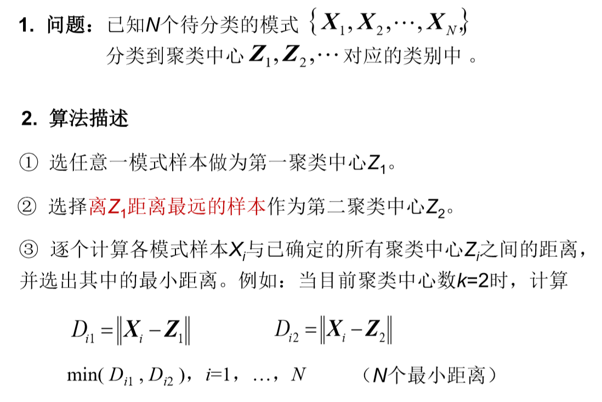

# 模式识别笔记

- [第二讲 聚类分析](#cluster_analysis)
  - [2.2 距离测度](#distance_measure)
  - [2.3 基于距离阈值的分类算法](#threshold_classification)
  - [2.4 层次聚类法](#level_cluster)
  - [2.5 动态聚类法](#dynamic_cluster)
    - [2.5.1 K-means](#k_means)
    - [2.5.2 ISODATA](#ISODATA)
- [第三讲 ](#)


<a id="cluster_analysis"></a>

# 第二讲 聚类分析

聚类分析：基于样本的相似性分类。

聚类结果取决于：

- 特征选择
- 量纲
- 聚类粒度粗细

<a id="distance_measure"></a>

## 2.2 距离测度

相似性的度量：**距离测度**。

### 欧氏距离

$$
D(x,y)=||x-y||=\sqrt{(x-y)^T(x-y)}
$$


### 马氏距离

$$
D^2=(\pmb X-\pmb M)^T\pmb C^{-1}(\pmb X-\pmb M)
$$

$\pmb X$：模式向量，$\pmb M$：均值向量，$\pmb C$：该类模式总体的协方差矩阵。
$$
\pmb C=E[(\pmb X-\pmb M)(\pmb X-\pmb M)^T]
$$
**避免了模式类的方差影响**。排除了模式样本之间的相关性影响。

当 $\pmb C=\pmb I$ 时，退化成欧氏距离。


### 明氏距离

$$
D_m(\pmb X,\pmb Y)=(\sum_{k=1}^n|x_k-y_k|^m)^{\frac{1}{m}}
$$

$m=2$ 时，为欧氏距离。

$m=1$ 时，为街坊距离。


### 汉明距离

设 $\pmb X,\pmb Y\in [-1,+1]^n$
$$
D_h(\pmb X,\pmb Y)=\frac{1}{2}(n-\sum_{k=1}^nx_k\cdot y_k)
$$
表示 $\pmb X,\pmb Y$ 的不同位数的个数。


### 角度相似距离

$$
S(\pmb X,\pmb Y)=\frac{\pmb X^T\pmb Y}{|\pmb X|\cdot |\pmb Y|}
$$

对于旋转和尺度缩放不变，但对一般线性变换不具有不变性。


### Tanimoto 测度

设 $\pmb X,\pmb Y\in [-1,+1]^n$，可以理解为 "交" 比 "或"。


## 聚类准则

1. 阈值准则
2. 函数准则


**适用范围**：适用于各类样本密集且数目相差不多，而不同类间的样本又明显分开的情况。

<a id="threshold_classification"></a>

## 2.3 基于距离阈值的分类算法

### 2.3.1 近邻聚类法


结果不唯一，依赖排列顺序和聚类中心的选择。


### 2.3.2 最大最小距离算法




解释：距离两个聚类中心 至少那么远中的足够远 的点有可能成为新的聚类中心。

> 注：这个算法的描述实在是太坑，在第4步返回第3步的时候，最小值只会更小，所以正确做法是：
>
> 第3步，找出所有超过T的点集A，选择最大的成为新的聚类中心$Z^{'}$，从A中剩下的这部分点向$Z^{'}$取最小值（min上和一开始的最小值），再淘汰一部分小于T的，重复直到结束。


<a id="level_cluster"></a>

## 2.4 层次聚类法

以下讨论凝聚式聚类，另有分裂式聚类。

### 2.4.1 算法描述


### 2.4.2 类间距离计算

#### 2.4.2.1 最短距离法


#### 2.4.2.2 最长距离法


#### 2.4.2.3 中间距离法


#### 2.4.2.4 重心法


#### 2.4.2.5 类平均距离法


<a id="dynamic_cluster"></a>

## 2.5 动态聚类法

- k-均值法
- ISODATA算法（迭代自组织数据分析算法）

<a id="k_means"></a>

### 2.5.1 K-均值法


算法描述：


结果容易受到 **$k$ 值** 和 **初始均值向量** 以及 **模式样本的几何性质** 的影响，

实际应用中，需要试探不同的K值和选择不同的聚类中心起始值。

[C++ 实现](https://github.com/rsy56640/daily_learning/blob/master/Machine_Learning/%E8%A5%BF%E7%93%9C%E4%B9%A6%E5%AD%A6%E4%B9%A0/code/k_means/k_means_in_Cpp/k_means.hpp)

[Python 实现](https://github.com/rsy56640/daily_learning/blob/master/Machine_Learning/%E8%A5%BF%E7%93%9C%E4%B9%A6%E5%AD%A6%E4%B9%A0/code/k_means/k_means_in_Python/k_means.py):

```python
import numpy as np
from functools import reduce


def k_means(cluster_num: int, dist, *data_set):
    size = len(data_set)
    assert size >= cluster_num > 0
    s = set()
    while len(s) != cluster_num:
        s.add(np.random.random_integers(0, size - 1))

    mean_vecs = []  # mean vectors in each cluster, initialized with random vector selected in data set.
    for num in s:
        mean_vecs.append(data_set[num])

    C = []  # clusters
    for i in range(cluster_num):
        C.append([])

    isChanged = True

    '''
    Divide each vector into one of the sets,
    and calculate the new mean_vecs.
    
    Loop until mean_vecs have no change.
    '''
    while isChanged:
        isChanged = False
        for c in C:
            c.clear()

        # for each vector in data set, divide it into one of the clusters.
        for vec in data_set:
            d = dist(vec, mean_vecs[0])
            label = 0
            for l in range(cluster_num):
                cur_dist = dist(vec, mean_vecs[l])
                if cur_dist < d:
                    d = cur_dist
                    label = l
            C[label].append(vec)

        # update mean_vecs, and set up `isChanged` flag if needed
        for label in range(cluster_num):
            assert len(C[label]) > 0
            mean_vec = reduce(lambda x, y: x + y, C[label]) / len(C[label])
            if dist(mean_vec, mean_vecs[label]) > 10e-2:
                mean_vecs[label] = mean_vec
                isChanged = True

    return C
```

<a id="ISODATA"></a>

### 2.5.2 ISODATA算法


