# 模式识别笔记

**课件pdf在Google云盘中**

- [介绍](#intro)

- [第二讲 聚类分析](#cluster_analysis)
  - [2.2 距离测度](#distance_measure)
  - [2.3 基于距离阈值的分类算法](#threshold_classification)
  - [2.4 层次聚类法](#level_cluster)
  - [2.5 动态聚类法](#dynamic_cluster)
    - [2.5.1 K-means](#k_means)
    - [2.5.2 ISODATA](#ISODATA)
  - [2.6 聚类结果的评价](#cluster_result_evaluation)

- [第三讲 判别函数分类法](#discrimination_function)

  - [3.2 线性判别函数](#linear)
  - [3.6 感知器算法](#perceptron)
  - [3.8 最小平方误差](#LMS)
  - [3.9 非线性判别函数](#non_linear)

- [第四讲 统计决策分类法](#statistics_decision)

  - [4.1 贝叶斯估计](#Beyesian)
  - [4.2 贝叶斯决策](#Beyesian_decision)
  - [4.3 贝叶斯分类器的错误率](#error_estimation)
  - [4.4 耐曼-皮尔逊决策](#Neyman_Pearson)
  - [](#)

- [第六讲 ](#)
- [第七讲 ](#)


<a id="intro"></a>

# 介绍


<a id="cluster_analysis"></a>

# 第二讲 聚类分析

聚类分析：基于样本的相似性分类。

聚类结果取决于：

- 特征选择
- 量纲
- 聚类粒度粗细

<a id="distance_measure"></a>

## 2.2 距离测度

相似性的度量：**距离测度**。

### 欧氏距离

$$
D(x,y)=||x-y||=\sqrt{(x-y)^T(x-y)}
$$

### 马氏距离

$$
D^2=(\pmb X-\pmb M)^T\pmb C^{-1}(\pmb X-\pmb M)
$$

$\pmb X$：模式向量，$\pmb M$：均值向量，$\pmb C$：该类模式总体的协方差矩阵。
$$
\pmb C=E[(\pmb X-\pmb M)(\pmb X-\pmb M)^T]
$$
**避免了模式类的方差影响**。排除了模式样本之间的相关性影响。

当 $\pmb C=\pmb I$ 时，退化成欧氏距离。

### 明氏距离

$$
D_m(\pmb X,\pmb Y)=(\sum_{k=1}^n|x_k-y_k|^m)^{\frac{1}{m}}
$$

$m=2$ 时，为欧氏距离。

$m=1$ 时，为街坊距离。

### 汉明距离

设 $\pmb X,\pmb Y\in [-1,+1]^n$
$$
D_h(\pmb X,\pmb Y)=\frac{1}{2}(n-\sum_{k=1}^nx_k\cdot y_k)
$$
表示 $\pmb X,\pmb Y$ 的不同位数的个数。

### 角度相似距离

$$
S(\pmb X,\pmb Y)=\frac{\pmb X^T\pmb Y}{|\pmb X|\cdot |\pmb Y|}
$$

对于旋转和尺度缩放不变，但对一般线性变换不具有不变性。

### Tanimoto 测度

设 $\pmb X,\pmb Y\in [-1,+1]^n$，可以理解为 "交" 比 "或"。


## 聚类准则

1. 阈值准则
2. 函数准则


**适用范围**：适用于各类样本密集且数目相差不多，而不同类间的样本又明显分开的情况。

<a id="threshold_classification"></a>

## 2.3 基于距离阈值的分类算法

### 2.3.1 近邻聚类法


结果不唯一，依赖排列顺序和聚类中心的选择。


### 2.3.2 最大最小距离算法


解释：距离两个聚类中心 至少那么远中的足够远 的点有可能成为新的聚类中心。

> 注：这个算法的描述实在是太坑，在第4步返回第3步的时候，最小值只会更小，所以正确做法是：
>
> 第3步，找出所有超过T的点集A，选择最大的成为新的聚类中心$Z^{'}$，从A中剩下的这部分点向$Z^{'}$取最小值（min上和一开始的最小值），再淘汰一部分小于T的，重复直到结束。


<a id="level_cluster"></a>

## 2.4 层次聚类法

以下讨论凝聚式聚类，另有分裂式聚类。

### 2.4.1 算法描述


### 2.4.2 类间距离计算

#### 2.4.2.1 最短距离法

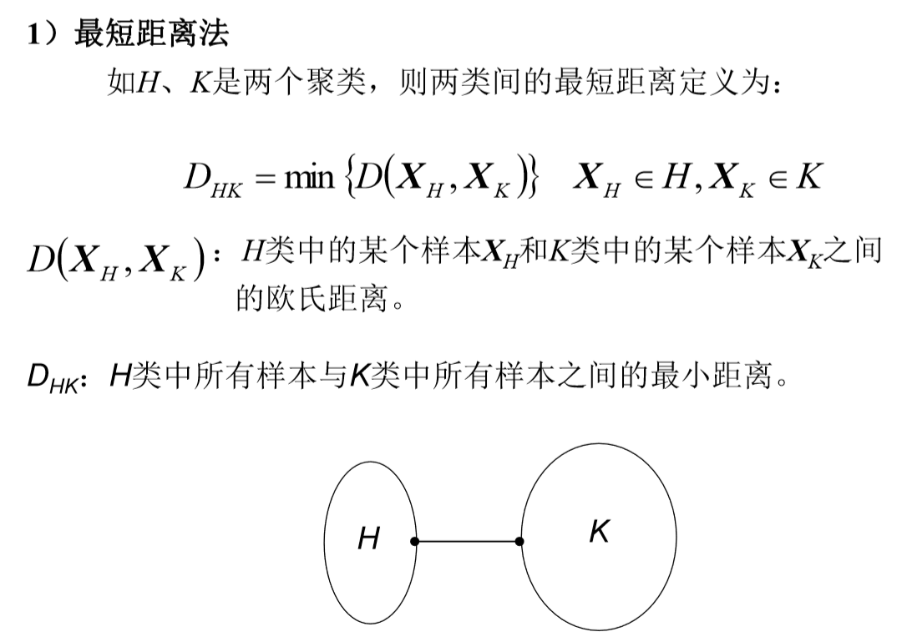


#### 2.4.2.2 最长距离法


#### 2.4.2.3 中间距离法

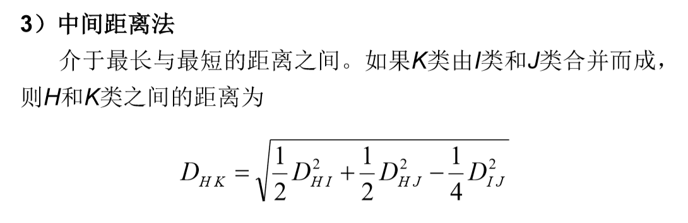

#### 2.4.2.4 重心法


#### 2.4.2.5 类平均距离法


<a id="dynamic_cluster"></a>

## 2.5 动态聚类法

- k-均值法
- ISODATA算法（迭代自组织数据分析算法）

<a id="k_means"></a>

### 2.5.1 K-均值法


算法描述：


结果容易受到 **$k$ 值** 和 **初始均值向量** 以及 **模式样本的几何性质** 的影响，

实际应用中，需要试探不同的K值和选择不同的聚类中心起始值。

[C++ 实现](https://github.com/rsy56640/daily_learning/blob/master/Machine_Learning/%E8%A5%BF%E7%93%9C%E4%B9%A6%E5%AD%A6%E4%B9%A0/code/k_means/k_means_in_Cpp/k_means.hpp)

[Python 实现](https://github.com/rsy56640/daily_learning/blob/master/Machine_Learning/%E8%A5%BF%E7%93%9C%E4%B9%A6%E5%AD%A6%E4%B9%A0/code/k_means/k_means_in_Python/k_means.py):

```python
import numpy as np
from functools import reduce


def k_means(cluster_num: int, dist, *data_set):
    size = len(data_set)
    assert size >= cluster_num > 0
    s = set()
    while len(s) != cluster_num:
        s.add(np.random.random_integers(0, size - 1))

    mean_vecs = []  # mean vectors in each cluster, initialized with random vector selected in data set.
    for num in s:
        mean_vecs.append(data_set[num])

    C = []  # clusters
    for i in range(cluster_num):
        C.append([])

    isChanged = True

    '''
    Divide each vector into one of the sets,
    and calculate the new mean_vecs.
    
    Loop until mean_vecs have no change.
    '''
    while isChanged:
        isChanged = False
        for c in C:
            c.clear()

        # for each vector in data set, divide it into one of the clusters.
        for vec in data_set:
            d = dist(vec, mean_vecs[0])
            label = 0
            for l in range(cluster_num):
                cur_dist = dist(vec, mean_vecs[l])
                if cur_dist < d:
                    d = cur_dist
                    label = l
            C[label].append(vec)

        # update mean_vecs, and set up `isChanged` flag if needed
        for label in range(cluster_num):
            assert len(C[label]) > 0
            mean_vec = reduce(lambda x, y: x + y, C[label]) / len(C[label])
            if dist(mean_vec, mean_vecs[label]) > 10e-2:
                mean_vecs[label] = mean_vec
                isChanged = True

    return C
```

<a id="ISODATA"></a>

### 2.5.2 ISODATA算法


<a id="cluster_result_evaluation"></a>

## 2.6 聚类结果的评价

1、评价的重要性

1. 对高维特征向量样本，不能直观看清聚类效果。
2. 人机交互系统中，需要迅速地判断中间结果，及时指导输入参数的改变，较快地获得较好的聚类结果。

2、常用的几个指标

1. 聚类中心之间的距离——越大越好。
2. 各个聚类域中样本数目——尽可能相差不大。
3. 各个聚类域内样本的标准差向量——尽可能小。


以上都是原则性要求。实际情况下，受模式实际分布情况的影响，需要综合权衡。比如：实际情况中的样本集的确包含两个类，但是类间距离本身不大，且类内方差偏大，如果简单按聚类准则函数的极值进行优化求解，很可能把本来属于同一类的模式强行分为两类！


<a id="discrimination_function"></a>

# 第三讲 判别函数分类法

几何分类法：使用代数方程进行分类。

## 3.1 判别函数

用来对模式进行分类的决策函数。
$$
d(\pmb X)=0
$$

<a id="linear"></a>

## 3.2 线性判别函数

$$
\begin{aligned}
d(\pmb X)
& = w_0 + \sum_{i=1}^n w_ix_i \\
& = \pmb W^T\pmb X
\end{aligned}
$$

其中 $\pmb W,\pmb X \in R^{n+1},\ \pmb W = (w_0,w_1,...,w_n)^T,\ \pmb X = (1,x_1,...,x_n)^T$


### 是非两分法


### 成对两分法


### 成对两分法特例（无不确定区）


## 3.3 广义线性判别函数

$$
d(\pmb X) = w_0 + \sum_{i=1}^n w_if(\pmb X)
$$


## 3.4 线性判别函数的几何性质

$$
\begin{aligned}
d(\pmb X)
& = \pmb W^T\pmb X \\
& = \pmb W^T(\pmb X-\pmb X_p) \\
& = \pmb W^T \cdot r \frac{\pmb W^T}{||\pmb W^T||} \\
& = r ||\pmb W^T||
\end{aligned}
$$

其中 $\pmb X_p$ 是 $\pmb X$ 到 $d(\pmb X)=0$ 上的投影点，$r$ 为距离。

$\pmb X$ 到平面 $d(\pmb X)=0$ 的代数距离为：$r=\frac{d(\pmb X)}{||\pmb W^T||}$


## 3.5 Fisher线性判别


<a id="perceptron"></a>

## 3.6 感知器算法

$$
d(\pmb X)=\pmb W^T\pmb X
$$

本节开始介绍如何通过各种算法，利用已知类别的模式样本训练权向量 $\pmb W$。

### 概念

$$
d(\pmb X)= \pmb W^T\pmb X
\begin{equation}
\left\{
        \begin{array}{lr}
            \gt 0, & \pmb X\in w_1  \\
            \lt 0, & \pmb X\in w_2  \\
        \end{array}
\right.
\end{equation}
$$

对样本进行规范化处理，，即 $ω_2$ 类样本全部乘以 $-1$，于是：

$$
d(\pmb X)=\pmb W^T\pmb X \gt 0
$$

### 感知器算法

**感知器算法的基本思想**：用训练模式验证当前权向量的合理性，如果不合理，就根据误差进行反向纠正，直到全部训练样本都被合理分类。本质上是梯度下降方法类。

1. 选择 $N$ 个样本集 $\{\pmb X_1,...,\pmb X_N\}\in \{w_1,w_2\}$，对于 $w_2$ 中样本做规范化，即乘 $-1$。任意取权向量 $\pmb W_1$，开始迭代。
2. 计算 $\pmb W^T_k\pmb X_i$，并修正：

- 若 $\pmb W^T_k\pmb X_i \le 0$，分类错误，校正为 $\pmb W_{k+1}=\pmb W_k +c\pmb X_i,\quad c\gt 0$
- 若 $\pmb W^T_k\pmb X_i\gt 0$，不变 $\pmb W_{k+1}=\pmb W_k$

3. 直到所有样本正确分类

$$
\pmb W_{k+1}=
\begin{equation}
\left\{
        \begin{array}{lr}
            \pmb W_k + c\pmb X_i, & \pmb W^T_k\pmb X_i \le 0  \\
            \pmb W_k,             & \pmb W^T_k\pmb X_i \gt 0  \\
        \end{array}
\right.
\end{equation}
$$

### 感知器算法的收敛性

收敛条件：模式类线性可分。

### 感知器算法用于多类情况

对于M类模式应存在M个判决函数，不用符号处理。

若 $\pmb X_i\in w_i$，则 $d_i(\pmb X)\gt d_j(\pmb X),\ \forall j\neq i$

若某个样本分类错误，则该权向量补偿，其他权向量抑制。


## 3.7 梯度算法

**负梯度指出了最陡下降方向**。—— 梯度算法的依据。

### 梯度算法

基本思路：定义一个对错误分类敏感的准则函数 $J(\pmb W,\pmb X)$，在 $J$ 的梯度方向上对权向量进行修改。
$$
\begin{aligned}
\pmb W_{k+1}
& = \pmb W_k - c\nabla J \\
& = \pmb W_k - c \left.\frac{\partial J(\pmb W,\pmb X)}{\partial \pmb W}\right|_{\pmb W = \pmb W_k} \\
\end{aligned}
$$
一般 $c$ 动态取值，开始较大，之后变小。


<a id="LMS"></a>

## 3.8 最小平方误差算法

(Least Mean Square Error, LMS, MSE；亦称 Ho-Kashyap 算法)

上述算法均要求模式类本身可分离，对于

- 模式本身不可分
- 迭代过程收敛缓慢

LMS 算法特点：

- 对可分模式收敛

- 对于类别不可分的情况也可以指出

### 分类器的不等式方程

感知器算法是解 $\pmb W^T \pmb X_i\gt 0$

### LMS算法

LSM算法是解 $\pmb X\pmb W=\pmb B\gt 0,\quad \pmb X =(\pmb X_1,...,\pmb X_i,-\pmb X_{i+1},...,\pmb -X_N)^T$
$$
\pmb W^T\pmb X_i = b_i \gt 0
$$
**LMS算法的出发点**：选择一个准则函数，使得当 $J$ 达到最小值时，$\pmb X\pmb W=\pmb B$ 可得到近似解（最小二乘近似解）。

准则函数：
$$
J(\pmb W,\pmb X,\pmb B) = \frac{1}{2}||\pmb X\pmb W -\pmb B||^2
$$

$$
\pmb X\pmb W-\pmb B =
\begin{pmatrix}
\pmb W^T \pmb X_1 - b_1 \\
\pmb W^T \pmb X_2 - b_2 \\
\vdots                  \\
\pmb W^T \pmb X_N - b_N \\
\end{pmatrix}
$$

$$
\begin{aligned}
J(\pmb W,\pmb X,\pmb B)
& = \frac{1}{2}||\pmb X\pmb W -\pmb B||^2 \\
& = \frac{1}{2} \sum_{i=1}^N (\pmb W^T\pmb X_i - b_i)^2
\end{aligned}
$$

使准则函数最小的解称为"最优近似解"。

### LMS算法递推公式


### 模式类别可分性判别


### LMS算法描述


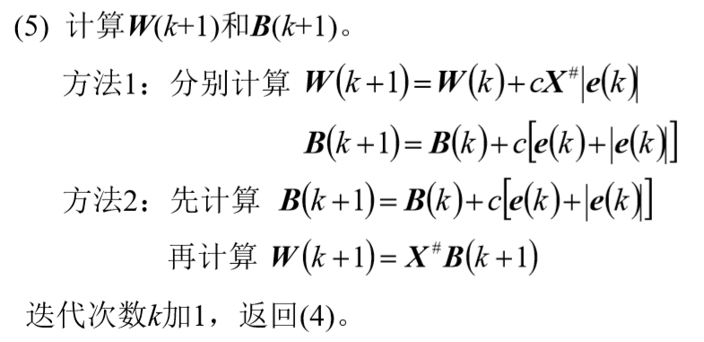

### 算法特点

- 算法尽管略为复杂一些，但提供了线性可分的测试特征。
- 同时利用 $N$ 个训练样本，同时修改 $\pmb W$ 和 $\pmb B$，故收敛速度快。
- 计算矩阵 $(\pmb X^T\pmb X)^{-1}$ 复杂，但可用迭代算法计算。 


## 小结

-  感知器法、梯度法、最小均方误差算法讨论的分类算法都是通过模式样本来确定判别函数的系数，所以要使一个分类器设计完善，必须采用有代表性的数据，训练判别函数的权系数。它们能合理反映模式数据的总体。
-  要获得一个有较好判别性能的线性分类器，所需要的训练样本的数目的确定。
-  用线性二分法容量 $N_0$ 来确定训练样本的数目：通常训练样本的数目不能低于 $N_0$，选为 $N_0$ 的 5~10 倍左右。
  - ​二维：不能低于 6 个样本，最好选在 30~60 个样本之间。 
  - 三维：不能低于 8 个样本，最好选在 40~80 个样本之间。


<a id="non_linear"></a>

## 3.9 非线性判别函数

### 3.9.1 分段线性函数

#### 一般线性分段函数

### 3.9.2 基于距离的分段线性判别函数

### 3.9.3 势函数法

将点看作点能源，考虑等势面作为分界面

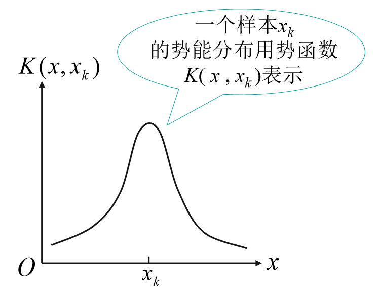

于是维护一个 $K(\pmb X)$ 作为势能函数

遍历所有样本：

- 若分类正确，$K(\pmb X)$ 不变
- 若分类不正确，更新 $K(\pmb X)$ 为

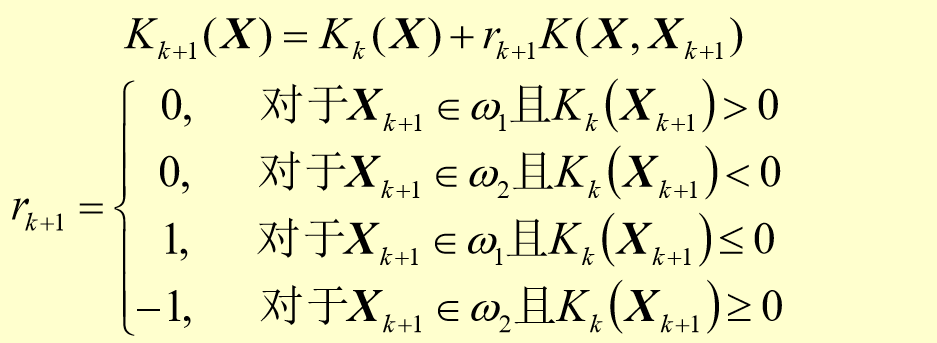


<a id="statistics_decision"></a>

# 统计决策分类法

<a id="Beyesian"></a>

## 4.1 贝叶斯估计

输入空间 $\mathcal{X}\subseteq \pmb R^n$，输入特征向量 $x\in \mathcal{X}$

输出空间 $\mathcal{Y}=\{c_1,c_2,...,c_K\}$，输出类标记 $y\in \mathcal{Y}$

先验概率分布 $P(Y=c_k),\quad k=1,2,...,K$

条件概率分布 $P(X=x|Y=c_k)=P(X^{(1)}=x^{(1)},...,X^{(n)}=x^{(n)}|Y=c_k),\quad k=1,2,...,K$

**条件独立性假设：**
$$
\begin{aligned}
P(X=x|Y=c_k)&
= P(X^{(1)}=x^{(1)},...,X^{(n)}=x^{(n)}|Y=c_k)\\&
= \prod_{j=1}^{n}P(X^{(n)}=x^{(n)}|Y=c_k)
\end{aligned}
$$
这相当于说：

​        **用于分类的特征在类确定的条件下都是条件独立的.**

朴素贝叶斯分类器：
$$
\begin{aligned}
y=f(x)&
= argmax_{c_k} P(Y=c_k|X=x)\\&
= argmax_{c_k} \frac{P(X=x|Y=c_k)P(Y=c_k)}{P(X=x)}\\&
= argmax_{c_k} P(X=x|Y=c_k)P(Y=c_k)\\&
= argmax_{c_k} P(Y=c_k)\prod_j P(X^{(j)}=x^{(j)}|Y=c_k)
\end{aligned}
$$

后验概率最大化的意义：**朴素贝叶斯法将实例分到后验概率中，这等价于期望风险最小化。**

假设选择0-1损失函数：
$$
L(Y,f(X))=
\begin{equation}
\left\{
        \begin{array}{lr}
            1, & Y\neq f(X)  \\
            0, & Y=f(X)      \\
        \end{array}
\right.
\end{equation}
$$
取条件期望
$$
\begin{aligned}
R_{exp}(f)&
= E(L(Y,f(x))|X=x)\\&
= \sum_{k=1}^K L(c_k,f(x))P(Y=c_k|X=x)\\&
= 1 - P(Y=f(x)|X=x)\\
f(x)&
= argmin_{f(x)}\ R_{exp}(f)\\&
= argmax_{c_k}\ P(Y=c_k|X=x)
\end{aligned}
$$
即后验概率最大化准则。

### 极大似然估计

条件概率 $P(Y=c_k)$ 的极大似然估计是：
$$
P(Y=c_k)=\frac{\sum_{i=1}^N I(y_i=c_k)}{N},\quad k=1,2,...,K
$$
设第 $j$ 个特征 $x^{(j)}$ 可能的取值集合为 $\{a_{j1},a_{j2},...,a_{jS_j}\}$，条件概率 $P(X^{(j)}=a_{jl}|Y=c_k)$ 的极大似然估计是：
$$
\begin{aligned}
& P(X^{(j)}=a_{jl}|Y=c_k)=\frac{\sum_{i=1}^N I(x_i^{(j)}=a_{jl},y_i=c_k)}{\sum_{i=1}^N I(y_i=c_k)}\\
& j=1,2,...,n;\quad l=1,2,...,S_j;\quad k=1,2,...,K
\end{aligned}
$$

### **朴素贝叶斯算法**(**naïve Bayes algorithm**)

​    输入：训练数据 $T=\{(x_1,y_1),(x_2,y_2),...,(x_N,y_N)\}$ ，其中 $x_i=(x_i^{(1)},x_i^{(2)},...,x_i^{(n)})^T$，$x_i^{(j)}$ 是第$i$个样本的第$j$个特征，$x_i^{(j)}\in\{a_{j1},a_{j2},...,a_{jS_j}\}$ ，$a_{jl}$ 是第$j$个特征的可能的第$l$个值，$j=1,2,...,n,\quad l=1,2,...,S_j,\quad y_i\in \{c_1,c_2,...,c_K\};$ 实例 $x;$

​    输出：实例 $x$ 的分类。

(1) 计算先验概率及条件概率
$$
\begin{aligned}
& P(Y=c_k)=\frac{\sum_{i=1}^N I(y_i=c_k)}{N},\quad k=1,2,...,K     \\
& P(X^{(j)}=a_{jl}|Y=c_k)=\frac{\sum_{i=1}^N I(x_i^{(j)}=a_{jl},y_i=c_k)}{\sum_{i=1}^N I(y_i=c_k)}                                          \\
& j=1,2,...,n;\quad l=1,2,...,S_j;\quad k=1,2,...,K
\end{aligned}
$$
(2) 对于给定的实例 $x=(x^{(1)},x^{(2)},...,x^{(n)})^T$，计算
$$
P(Y=c_k)\prod_{j=1}^n P(X^{(j)}=x^{(j)}|Y=c_k)
$$
(3) 确定实例 $x$ 的类
$$
y=argmax_{c_k} P(Y=c_k)\prod_{j=1}^n P(X^{(j)}=x^{(j)}|Y=c_k)
$$

### 贝叶斯估计

用极大似然估计可能出现0，这会影响到之后的计算。

因此做一些修正，使用 **贝叶斯估计**。

条件概率的贝叶斯估计是
$$
\begin{aligned}
& P_\lambda(X^{(j)}=a_{jl}|Y=c_k)=\frac{\lambda + \sum_{i=1}^N I(x^{(j)}=a_{jl},y_i=c_k)}{S_j\lambda + \sum_{i=1}^N I(y_i=c_k)}    \\
& P_\lambda(Y=c_k)=\frac{\lambda + \sum_{i=1}^N I(y_i=c_k)}{N+K\lambda}
\end{aligned}
$$
可以证明这依然是概率分布，略。

式中 $\lambda\ge 0$，**等价于在随机变量各个取值的频数上赋予一个正数 $\lambda>0$**

**注：**

1. 通过贝叶斯估计处理之后的频数是**无法还原**成真实数据的（**除非**随机变量的每个特征的取值集合拥有相同的基数），即不存在真实的数据，由其计算而来的频数如此分布。（possible risk???）
2. 其实就是统计完频数之后发现有些地方为0或差距太大，因此做一些**平滑处理**，如果觉得统一加一个数效果不好，那可以采用其他的平滑，可以参考数字图像处理中的一些技术。（不过当然要满足概率分布）

### 小结

1. 概率估计方法：极大似然估计，贝叶斯估计
2. 一个较强的假设：条件独立
3. 后验概率最大 <=> 0-1损失函数时的期望风险最小化


<a id="Beyesian_decision">

## 4.2 贝叶斯决策

### 4.2.2 最小风险贝叶斯决策

最小风险贝叶斯决策基本思想：**以各种错误分类所造成的条件风险（后验风险）最小为规则，进行分类决策。**

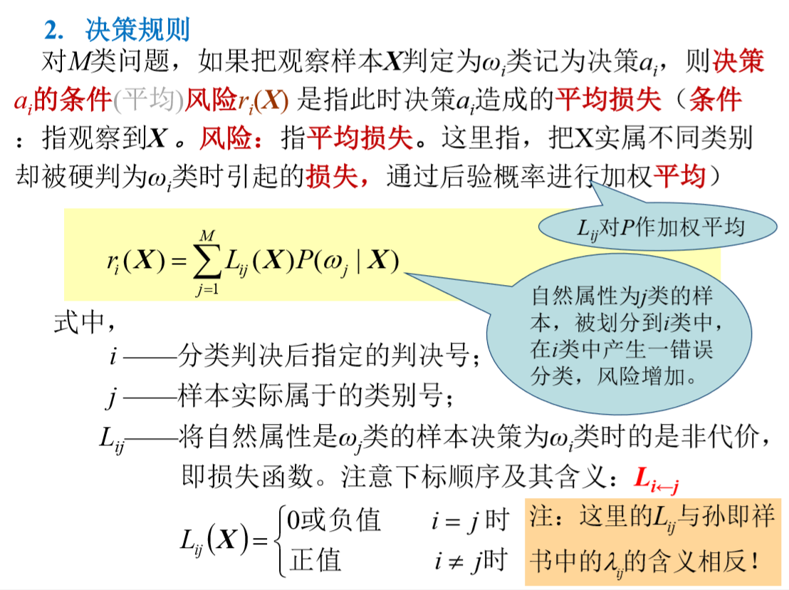

**风险 $r_i(\pmb X)$ 是指：把观察样本 $\pmb X$ 判定为 $w_i$ 类所造成的平均损失。**

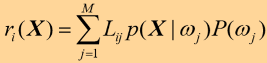

决策规则：

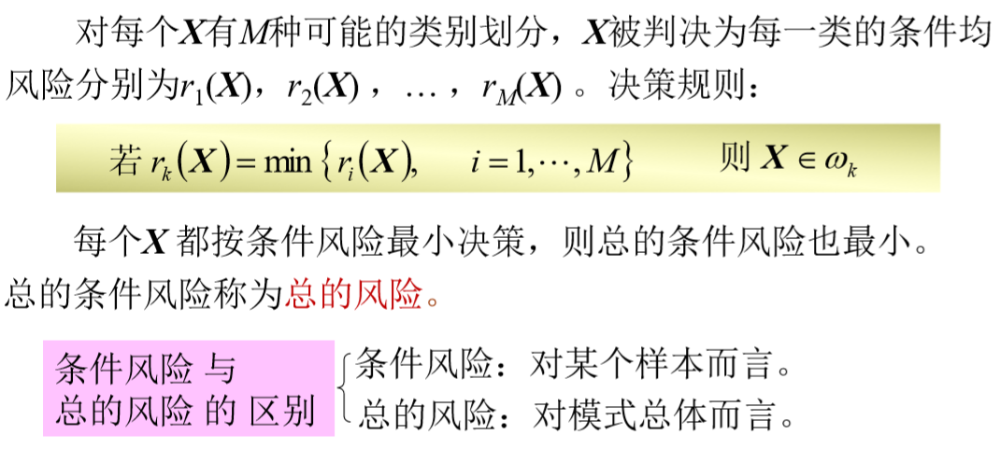


### $0-1$ 损失最小风险贝叶斯决策

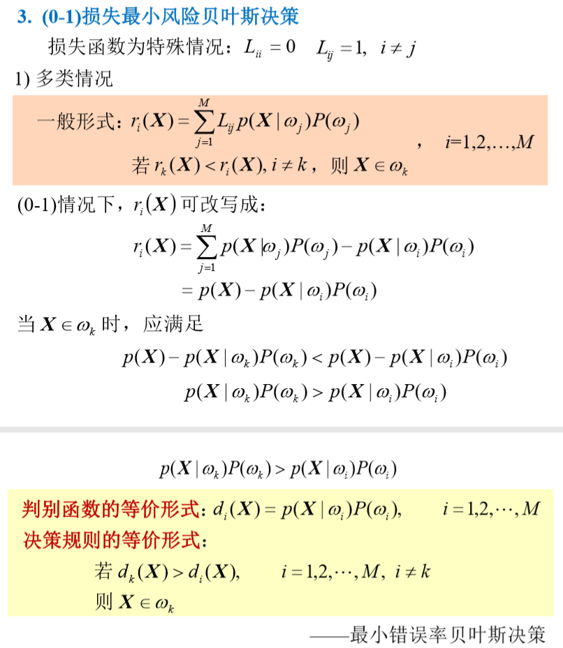


### 正态分布的最小错误率贝叶斯决策

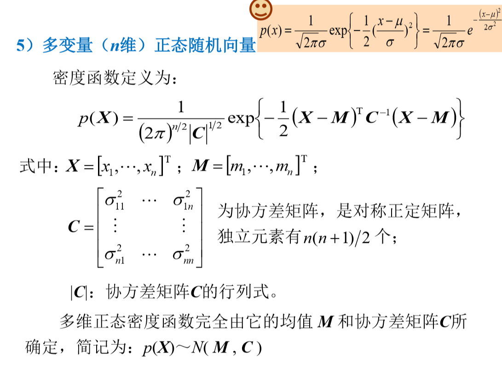

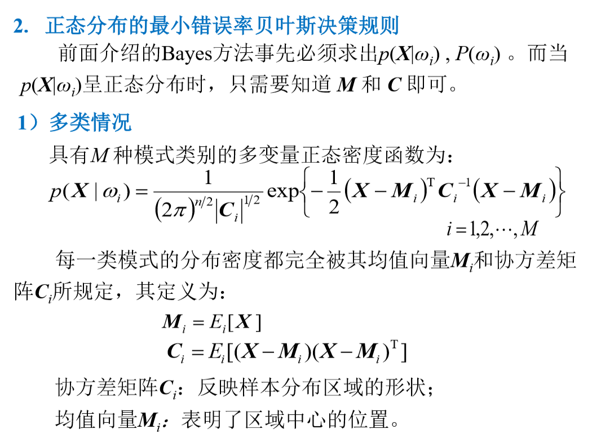

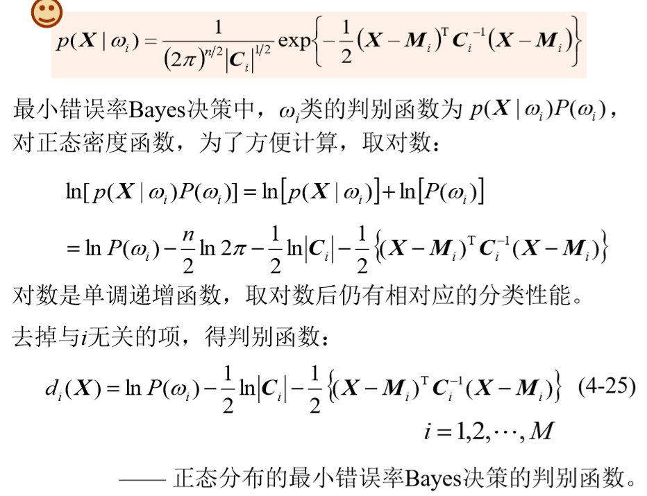


<a id="error_estimation"></a>

## 4.3 贝叶斯分类器的错误率

**错误率**：将应属于某一类的模式错分到其他类中的概率。是衡量分类器性能优劣的重要参数。
$$
P(e) = \int_{-\infty}^{\infty}P(e|\pmb X)p(\pmb X)d\pmb X
$$
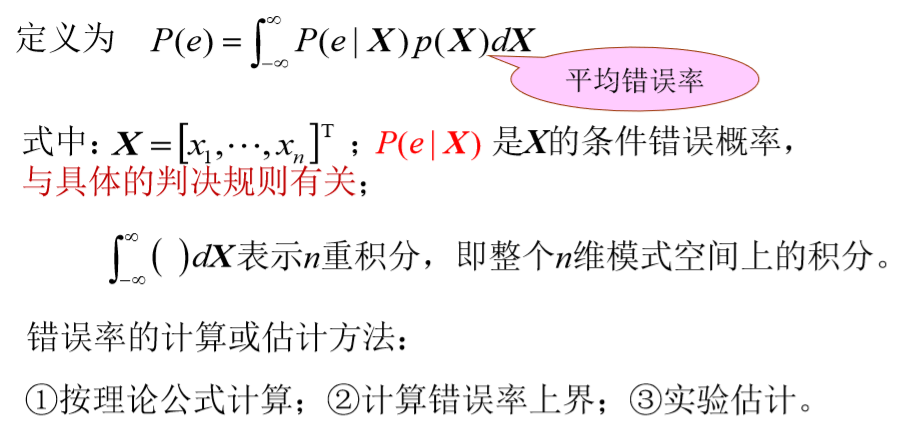


### 错误率的估计：

**分类器已知**：

1）先验概率未知————随机抽样
$$
\hat \epsilon = \frac{k}{N}
$$
$N$ ：随机抽取的样本数

$k$ ：错分样本数

2）先验概率已知————选择性抽样

分别从 $w_1$ 和 $w_2$ 中抽取 $N_1$ 和 $N_2$ 个样本，用 $N1+N2=N$ 个样本对设计好的分类器作分类检验。
$$
N_1=P(w_1)N,\ N_2=P(w_2)N
$$
设 $ω_1$ 类被错分的个数为 $k_1$，$ω_2$ 类错分的个数为 $k_2$。$k_1$、$k_2$统计独立，联合概率为
$$
P(k_1,k_2)=P(k_1)P(k_2) = \prod_{i=1}^2 \binom{N_i}{k_i} \epsilon^k_i (1-\epsilon_i)^{N_i-k_i}
$$
式中，$\epsilon_i$是 $w_i$类的真实错误率。总错误率的最大似然估计为
$$
\hat \epsilon = P(w_1)\frac{k_1}{N_1} + P(w_2)\frac{k_2}{N_2}
$$
**分类器未知**：

要求：用收集到的有限的N个样本设计分类器并估计其性能。

错误率的函数形式：$\epsilon(\theta_1, \theta_2)$

$\theta_1$：用于设计分类器的样本的分布参数

$\theta_2$：用于检验分类器性能的样本的分布参数


<a id="Neyman_Pearson"></a>

## 4.4 耐曼-皮尔逊决策

基本思想：限制某一类错误率为一个确定值，求取使得另一类错误率最小的判决规则与判决阈值（二类问题）。


